🛡️ **Aegis Overwatch**: Autonomous AI-Driven XDR  
**The Zero-Trust, Dual-Hybrid Intelligence Framework**

Aegis Overwatch is a bleeding-edge, autonomous Endpoint Detection and Response (EDR) framework designed to solve the two greatest crises in modern cybersecurity: catastrophic SOC burnout and the unacceptable enterprise risk of unstructured AI access. 

Unlike traditional signature-based tools or vulnerable "AI wrappers," Aegis uses a hybrid mathematical and neural architecture to bridge raw kernel telemetry with high-level cognitive reasoning. It decouples the **Nervous System** (deterministic local sensors) from the **Brain** (LLM-driven triage), enforcing strict zero-trust parameters at every layer of execution.

---

### 🏗️ The Aegis Architecture

```mermaid
flowchart LR
    %% Bleeding-Edge Styling
    classDef edge fill:#1e293b,stroke:#3b82f6,stroke-width:2px,color:#f8fafc
    classDef boundary fill:#450a0a,stroke:#ef4444,stroke-width:2px,stroke-dasharray: 5 5,color:#f8fafc
    classDef brain fill:#312e81,stroke:#8b5cf6,stroke-width:2px,color:#f8fafc
    classDef cage fill:#064e3b,stroke:#10b981,stroke-width:2px,color:#f8fafc

    %% Phase 1: Zero-Cost Edge Filtering
    subgraph Edge ["1. SOVEREIGN EDGE (Deterministic Filtering)"]
        direction TB
        Raw["<b>NATIVE TELEMETRY</b><br/><i>ETW & WFP Streams</i>"]:::edge
        Sifter["<b>MORPHOLOGICAL SIFTER & DB HUNTER</b><br/><i>Math & Jitter-Traps.<br/>Kills 95% of noise locally.</i>"]:::edge
        ONNX["<b>Machine Learned (v35k ONNX SPECIALIST)</b><br/><i>Neural Scoring<br/>(Zero Token Cost)</i>"]:::edge
        
        Raw --> Sifter --> ONNX
    end

    %% Phase 2: The Absolute Security Boundary
    subgraph Airlock ["2. ZERO-TRUST BOUNDARY"]
        Gateway["<b>CRYPTOGRAPHIC PRIVACY GATEWAY</b><br/><i>HMAC-SHA256 PII Masking & Semantic Airlock.<br/>Immunizes against Prompt Poisoning.</i>"]:::boundary
    end

    %% Phase 3: The Intelligence Engine
    subgraph Cognitive ["3. DUAL-HYBRID SYNTHESIS"]
        direction TB
        Cloud["<b>STRATEGIC CLOUD ACTUARY</b><br/><i>Frontier LLM (Primary)</i>"]:::brain
        Local["<b>LOCAL SOVEREIGN CORE</b><br/><i>Air-Gapped LLM (Cognitive Failover)</i>"]:::brain
    end

    %% Phase 4: Mathematical Execution Control
    subgraph Execution ["4. KINETIC CAGING"]
        direction TB
        Judge["<b>INTENT GOVERNANCE JUDGE</b><br/><i>Deterministic Veto Gatekeeper.<br/>Prevents AI-Driven Self-Destruction.</i>"]:::cage
        Terminal["<b>WAR TERMINAL UI</b><br/><i>Clinical Remediation</i>"]:::cage
        
        Judge --> Terminal
    end

    %% Routing
    ONNX -->|S > 0.70 Threat DNA| Gateway
    Gateway -->|Sanitized Context| Cloud
    Gateway -.->|Offline / API Outage| Local
    
    Cloud -->|Proposed Playbook| Judge
    Local -->|Proposed Playbook| Judge
```



---

### ⚡ Core Architectural Innovations

Aegis is built around several pioneering subsystems that force autonomous intelligence to operate within mathematically unbreakable bounds.

#### 1. The Master Strategic Audit (The Crowning Achievement)
Standard volumetric alerts completely miss "Low and Slow" Advanced Persistent Threats (APTs). The Aegis **Strategic DB Hunter** solves this with a one-click, unified 7-day historical audit. It leverages a 12-hour "Nexus Hindsight" aggregator to sweep isolated, low-volume events across multiple ports. By applying a custom **Jitter-Trap Uniformity Test**, it calculates the Coefficient of Variation (CV) to mathematically prove when seemingly "irregular background noise" is actually a perfectly synthetic, LLM-augmented C2 beacon. 

#### 2. The Semantic Airlock & Cryptographic Privacy Gateway
Before any telemetry is evaluated by an LLM, it must survive the Privacy Gateway. This is an absolute zero-trust boundary. It utilizes deterministic HMAC-SHA256 hashing to mask PII, enterprise secrets, and infrastructure (e.g., translating a private IP to `[LAN_IP_A7F9B2]`). This allows the AI to accurately track lateral movement over days without ever seeing raw data. Simultaneously, the **Semantic Airlock** preemptively destroys Base64 payloads and neutralizes embedded jailbreak attempts, fully immunizing the framework against prompt-poisoning.

#### 3. Intent Governance & Kinetic Caging
Giving autonomous agents unstructured access to the OS is a critical enterprise liability. Aegis physically severs reasoning from execution. When the Cloud Actuary proposes a remediation action (e.g., `KILL_PROCESS` or `ISOLATE_HOST`), the **Intent Governance Judge** evaluates it against a localized vault of protected OS primitives (like `lsass.exe` or `svchost.exe`). If the AI hallucinates or attempts an action that exceeds its autonomous bounds, the deterministic Python gatekeeper mathematically vetoes it, preventing AI-driven self-destruction.

#### 4. Dual-Hybrid Cognitive Resilience
Organizations no longer have to choose between the analytical power of the cloud and the privacy of local models. Aegis runs on a hot-swappable architecture. It reaches its peak potential synthesizing temporal kill-chains via the Cloud Actuary (Gemini 1.5 Flash). However, if an adversary severs external routing or an API outage occurs, Aegis executes an **Autonomous Cognitive Failover**. It seamlessly reroutes high-risk threat DNA to the air-gapped Sovereign Local Core (Llama 3.2 1B), keeping the endpoint securely fortified in a "degraded but defended" state.

#### 5. IP Maturation & Dynamic Rule Sealing
Aegis learns dynamically without degrading its security posture. If the Master Audit flags an obfuscated internal script that the SOC team verifies as benign, the system initiates a cryptographically secure "Mark Safe and Learn" protocol. The morphological DNA of that specific execution lineage is extracted and injected into the *Aegis Constitution* as a hardened failsafe. The database is instantly resealed with an HMAC-SHA256 signature to mathematically prevent adversaries from silently adding malware to the whitelist.

---

### 🚀 Deployment & Onboarding

**Prerequisites**
- Windows 10/11 (Admin rights required)
- Python 3.10+
- Npcap (for Native ETW/WFP Network Sifting)
- Ollama 

**One-Click Deploy (Admin Rights)**
```powershell
.\Deploy-Aegis.bat
```

This script handles the full lifecycle:
- Creates a pristine virtual environment
- Installs all dependencies (FastAPI, Jinja2, ONNX runtime, etc.)
- Auto-provisions Ollama endpoints if missing
- Creates the local desktop shortcut
- Ignites the C2 terminal

(Total Deployment Phase approx 8-12 minutes)

After deployment,  `Aegis-Switch.bat` will automatically launch to access the War Terminal at `http://localhost:8000/dashboard`. Otherwise, the Aegis Shortcut will be set up on desktop for return use.

**First-Time Ignition**
The local UI will initialize the setup sequence:
1. Generate your cryptographic master key (AEGIS_API_KEY) for local data attestation.
2. Select your cognitive engine: Cloud (Gemini) or Sovereign (Ollama).
3. (Optional) Integrate VirusTotal API credentials.

---

### 🛠️ Tech Stack

- **Intelligence**: Gemini 3.1 Flash (Cloud) + Llama 3.2 1B (Sovereign via Ollama)
- **Mathematical Sifting**: SciPy, Numpy, Custom Morphological Entropy Algorithms
- **Backend Orchestration**: FastAPI + Uvicorn + SQLite (WAL-optimized for compaction)
- **Forensics & Triage**: ONNX Neural Networks, Npcap, Windows ETW/WFP
- **Security Governance**: HMAC-SHA256 Crypto-Sealing, Deterministic Sandbox Routing

---

**License** MIT License — see [LICENSE](LICENSE) for details.

**Author**: Jacob Derwojed (KodenameRed)