🛡️ **Aegis Overwatch**: Autonomous AI-Driven XDR  
**The Zero-Trust, Dual-Hybrid Intelligence Framework**

Aegis Overwatch is a bleeding-edge, autonomous Endpoint Detection and Response (EDR) framework. Unlike traditional signature-based tools, Aegis uses a hybrid mathematical + neural architecture to bridge raw kernel telemetry and high-level cognitive reasoning.

It decouples the **Nervous System** (local sensors + math engine) from the **Brain** (LLM-driven triage) and features a dynamic **Dual-Hybrid Routing System** — cloud-scale AI for speed and an air-gapped Sovereign core as absolute failsafe.

---

### 🏗️ The Aegis Architecture

```mermaid
flowchart LR
    %% Bleeding-Edge Styling
    classDef edge fill:#1e293b,stroke:#3b82f6,stroke-width:2px,color:#f8fafc
    classDef boundary fill:#450a0a,stroke:#ef4444,stroke-width:2px,stroke-dasharray: 5 5,color:#f8fafc
    classDef brain fill:#312e81,stroke:#8b5cf6,stroke-width:2px,color:#f8fafc
    classDef cage fill:#064e3b,stroke:#10b981,stroke-width:2px,color:#f8fafc

    %% Phase 1: Zero-Cost Edge Filtering
    subgraph Edge ["1. SOVEREIGN EDGE (Deterministic Filtering)"]
        direction TB
        Raw["<b>NATIVE TELEMETRY</b><br/><i>ETW & WFP Streams</i>"]:::edge
        Sifter["<b>MORPHOLOGICAL SIFTER & DB HUNTER</b><br/><i>Math & Jitter-Traps.<br/>Kills 95% of noise locally.</i>"]:::edge
        ONNX["<b>Machine Learned (v35k ONNX SPECIALIST)</b><br/><i>Neural Scoring<br/>(Zero Token Cost)</i>"]:::edge
        
        Raw --> Sifter --> ONNX
    end

    %% Phase 2: The Absolute Security Boundary
    subgraph Airlock ["2. ZERO-TRUST BOUNDARY"]
        Gateway["<b>CRYPTOGRAPHIC PRIVACY GATEWAY</b><br/><i>HMAC-SHA256 PII Masking & Semantic Airlock.<br/>Immunizes against Prompt Poisoning.</i>"]:::boundary
    end

    %% Phase 3: The Intelligence Engine
    subgraph Cognitive ["3. DUAL-HYBRID SYNTHESIS"]
        direction TB
        Cloud["<b>STRATEGIC CLOUD ACTUARY</b><br/><i>Frontier LLM (Primary)</i>"]:::brain
        Local["<b>LOCAL SOVEREIGN CORE</b><br/><i>Air-Gapped LLM (Cognitive Failover)</i>"]:::brain
    end

    %% Phase 4: Mathematical Execution Control
    subgraph Execution ["4. KINETIC CAGING"]
        direction TB
        Judge["<b>INTENT GOVERNANCE JUDGE</b><br/><i>Deterministic Veto Gatekeeper.<br/>Prevents AI-Driven Self-Destruction.</i>"]:::cage
        Terminal["<b>WAR TERMINAL UI</b><br/><i>Clinical Remediation</i>"]:::cage
        
        Judge --> Terminal
    end

    %% Routing
    ONNX -->|S > 0.70 Threat DNA| Gateway
    Gateway -->|Sanitized Context| Cloud
    Gateway -.->|Offline / API Outage| Local
    
    Cloud -->|Proposed Playbook| Judge
    Local -->|Proposed Playbook| Judge
```



---

### ⚡ Core Features

- **Dual-Hybrid Neural Routing** — Cloud (Gemini) or Sovereign Local (Ollama) with automatic fallback
- **Nexus Dossier Compilation** — Auto-correlates host + network anomalies into executive summaries
- **Neural Specialist Pre-Scoring** — v35k ONNX model does sub-millisecond triage
- **Deterministic Intent Governance** — Hardcoded safety layer prevents dangerous AI actions
- **Network Jitter Analysis** — Detects robotic C2 beaconing via rhythm & volume baselines

---

### 🚀 Deployment & Onboarding

**Prerequisites**
- Windows 10/11 (Admin rights required)
- Python 3.10+
- Npcap (for Network Sentinel)
- Ollama (optional but recommended for Sovereign mode)

**One-Click Deploy**
```powershell
.\Deploy-Aegis.bat
```

This script:
- Creates a clean virtual environment
- Installs all dependencies (FastAPI, Jinja2, ONNX, etc.)
- Sets up Ollama automatically if missing
- Creates a desktop shortcut
- Launches the C2 console

After deployment, open `Aegis-Switch.bat` (or the desktop shortcut) → the web dashboard will open at `http://localhost:8000/dashboard`.

**First-Time Setup**
The UI will guide you through:
1. Creating your cryptographic master key (AEGIS_API_KEY)
2. Choosing Cloud (Gemini) or Sovereign (Ollama) mode
3. (Optional) Adding VirusTotal API key

---

### 🛠️ Tech Stack

- **Intelligence**: Gemini 1.5 Flash (Cloud) + Llama 3.2 1B (Sovereign via Ollama)
- **Backend**: FastAPI + Uvicorn + SQLite (WAL)
- **Forensics**: ONNX models, Npcap, Sysmon integration
- **Security**: HMAC-SHA256 signing, Deterministic Intent Governance

---

**License**  
MIT License — see [LICENSE](LICENSE) for details.

**Author**: Jacob Derwojed (KodenameRed)

---


